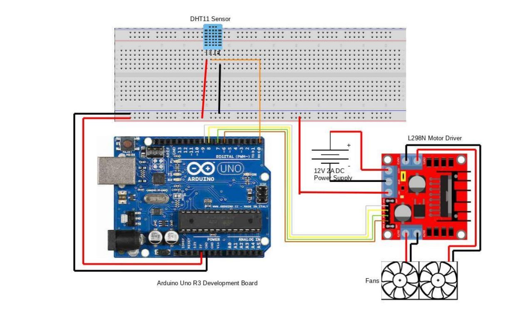
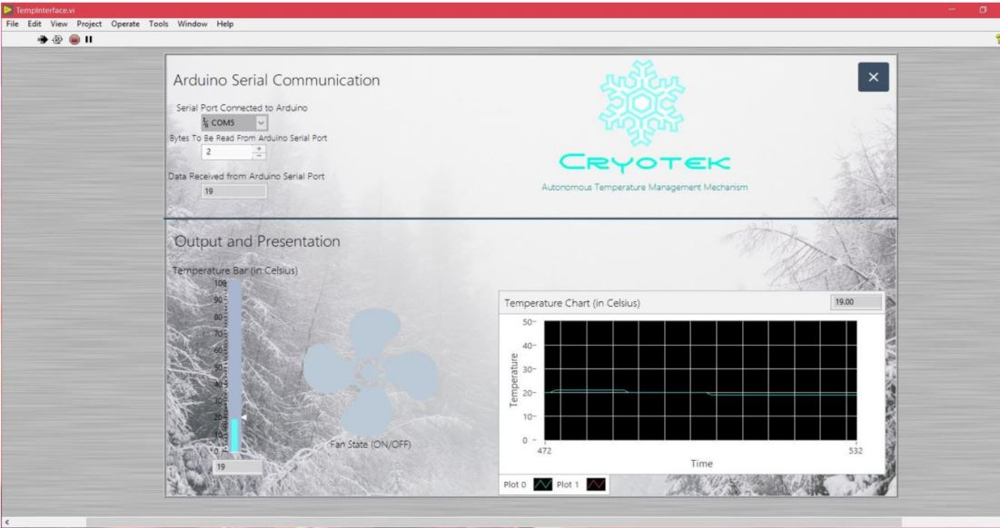
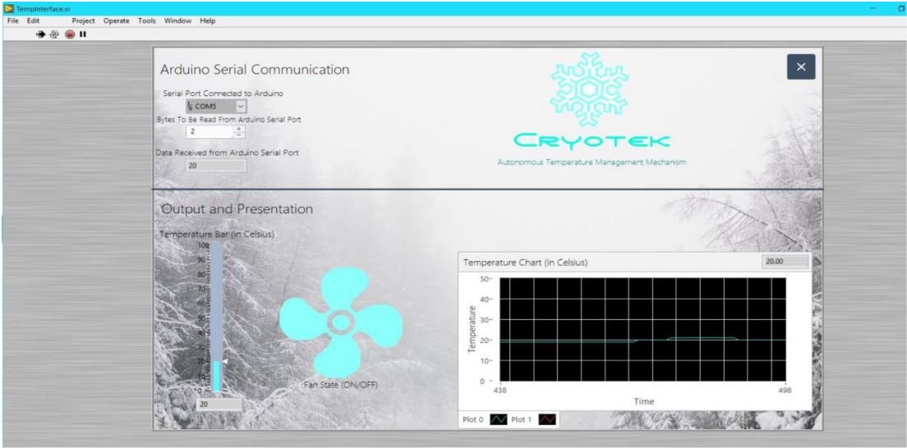

# Autonomous-Temperature-Controller
In this project i have built a system that can monitor the temperature of a system and trigger a mechanism to control it using Arduino, with LabVIEW as the interface.

By continuously monitoring the temperature of a system, the project aims to control the temperature such that it is within a specified range.
This can be used to control the cooling systems of temperature-critical applications such as in nuclear power plants. 

The temperature and humidity are being represented in the form of a graph in LabVIEW.

 **Block Diagram-1**: *Interfacing Hardware and Software*

 **Block Diagram-2**: *Input output -block diagram*

 **Software Requirements:**

**1.LABVEIW:** **Lab**oratory **V**irtual **I**nstrumentation **E**ngineering **W**orkbench
LabVIEW is a software development environment and language created by National Instruments.Its key innovation is that it uses graphical diagrams rather than lines of text which makes it more intuitive for engineers and excellent for parallel programming.

**2.Arduino IDE:**
The Arduino Integrated Development Environment - or Arduino Software (IDE) – is an open-source software which contains a text editor for writing code, a message area, a text console, a toolbar with buttons forcommon functions and a series of menus. It connects to the Arduino and Genuino hardware to upload programs and communicate with them. 

 **Hardware Requirements:**
 
i. Development board: Arduino Uno

ii. Motor Driver: L298N H-Bridge motor driver

iii. Temperature controller: 2 x PC Cabinet Fans

iv. Temperature sensor: DHT11

v. Breadboard

vi. Jumper cables

vii. 12V /2A DC power supply

 ***Circuit Design:***

 ***Practically Implimented fully functional circuit:***

 **Design of our Circuit's Front Panel Window in LABVIEW:**

*Case I: Temperature is equal to Threshold Temperature(19ºC)*

*Case II: Temperature is above Threshold Temperature (20ºC >19ºC)*

 **Circuit’s Block Diagram Window:**

***Arduino serial communication:***

• Serial port connected to Arduino: COM5

• Bytes to be read from Arduino Serial port:2

• The VI’s are arranged in this following manner in block diagram window of the LabVIEW software to run in front panel.

*VI’s used in designing our Interfaced circuit in LabVIEW:*

 **Working Principle:**

• Within the sensor, temperature gives rise to a potential difference which is proportional to the temperature.

• This generates a signal which is transferred to the Arduino board. 

• The Arduino board reads this signal and sends it to the serial port in the form of a string, and then compares it to see if it is above or below the threshold temperature, consequently turning the fans ‘on’ or ‘off’ respectively.

• Inside LabVIEW, the VI reads the serial data which has the temperature readings, and outputs it in a presentable format in the form of a thermometer and a graph in the front panel. 

• It also determines whether the fans are ‘on’ or not and indicates the same on the front panel.

 **Results:**

An automatic temperature controller has thus been successfully assembled and demonstrated using Arduino with LabVIEW as the interface between the board and the PC.

**Advantages & Disadvantages:**

 **Advantages:**

• Little to no human intervention, resulting in a very low probability for errors.

• Offers the possibility of connecting other devices to the same platform with ease.

• Safely reduces the temperature to the threshold temperature in case report system heats up.

 **Disadvantages:**

• Expensive and not cost-efficient.

 **Applications:**

• Used as Fan controllers in computers.

• Controller for cooling systems such as air-conditioners in buildings.

• Controllers for cooling systems in nuclear reactors.

• Climate control systems in automobiles.

• Used in Smart home Air conditioning systems.
